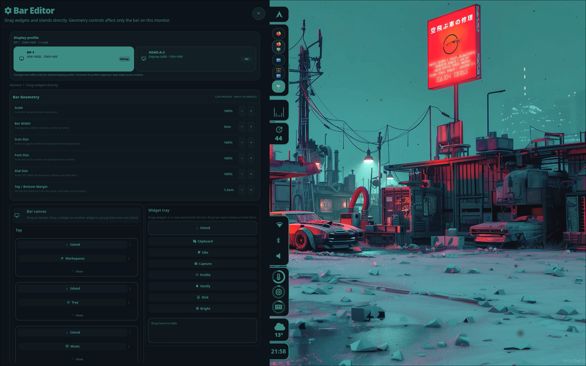
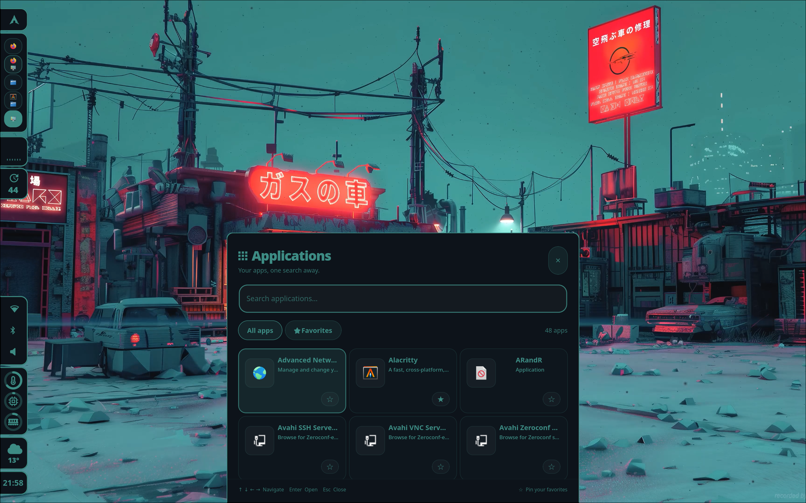
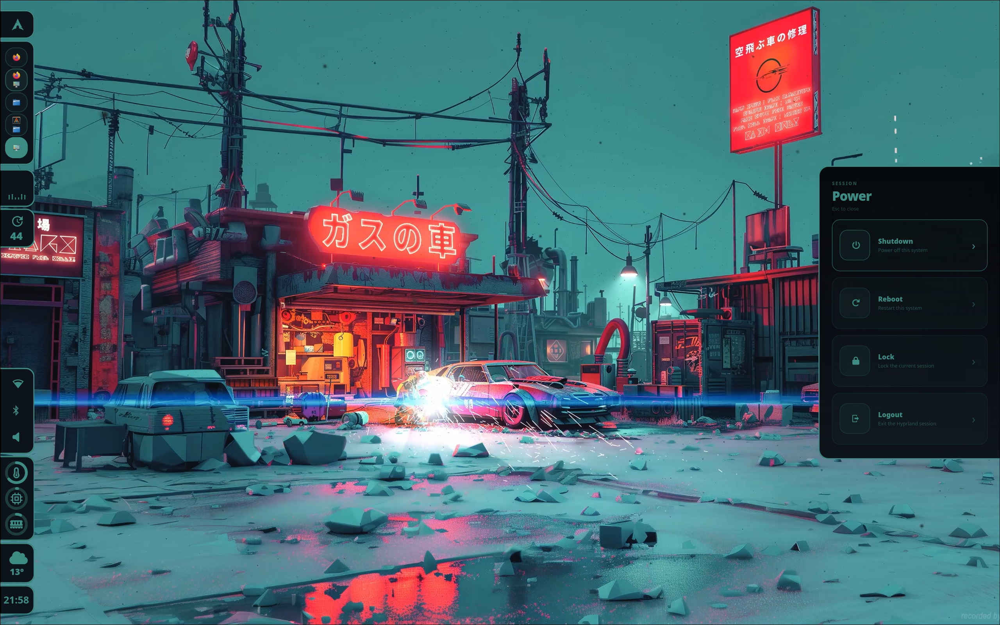
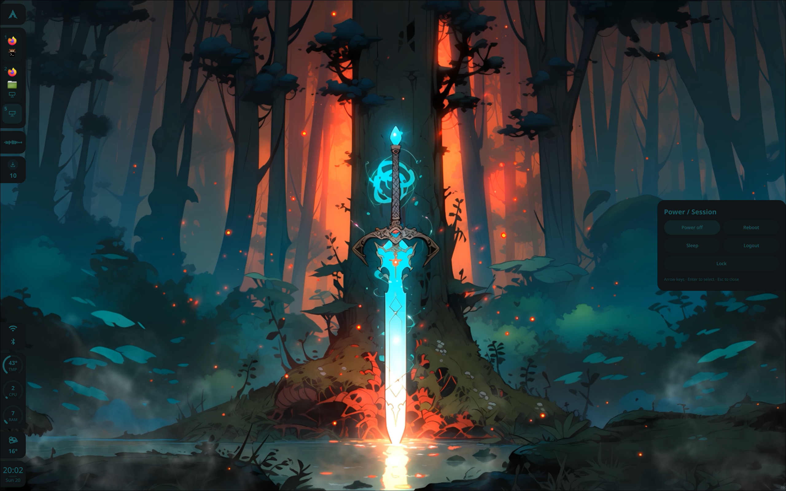

# HyprL4zy

> [!WARNING]
> **Beta software.** HyprL4zy is still under active development and may include breaking changes.

A modular **Arch Linux + Hyprland** rice built with **Quickshell/QML**, Pywal colors, contextual modules, custom Studios and a fixed vertical island bar.

<div align="center">

# HyprL4zy


<br><br>

### Screenshots

<p align="center">
  <a href="assets/screenshots/01.png">
    
  </a>
</p>

<table>
  <tr>
    <td width="50%">
      <a href="assets/screenshots/02.png">
        
      </a>
    </td>
    <td width="50%">
      <a href="assets/screenshots/03.png">
        
      </a>
    </td>
  </tr>
  <tr>
    <td width="50%">
      <a href="assets/screenshots/04.png">
        
      </a>
    </td>
    <td width="50%">
      <a href="assets/screenshots/05.png">
        
      </a>
    </td>
  </tr>
</table>

## Features

- Quickshell/QML vertical island bar
- Native Hyprland workspaces, system tray, notifications and MPRIS integration
- Native Quickshell PipeWire, UPower, Bluetooth and NetworkManager integrations
- iwd/`iwctl` Wi-Fi fallback when NetworkManager is not the active stack
- Pywal `@background` surfaces with a selectable `@colorN` accent
- Application Studio, Wallpaper Studio, notification center and contextual module panels
- Image and video wallpapers with `awww`, `mpvpaper`, FFmpeg and Pywal
- Portable multi-monitor baseline with machine-local overrides in `local.conf`
- Incremental Arch installer/updater with backups and restore
- Mandatory `paru` AUR helper, bootstrapped automatically when missing
- Optional Dynamic Bubble SDDM integration

## Install

```bash
git clone https://github.com/L4ZY404/HyprL4zy.git
cd HyprL4zy
./install.sh plan
./install.sh install
./install.sh doctor
```

Use `--minimal` to skip the optional desktop-program bundle. The installer requires `paru`; if it is missing, it bootstraps `paru` from the AUR before installing the required AUR packages.

## Update an existing HyprL4zy installation

Pull the repository and run:

```bash
git pull --ff-only
./install.sh plan
./install.sh update
./install.sh doctor
```

The updater compares the repository with the installed managed files and only copies files that changed. It also removes files that were managed by an older HyprL4zy release but no longer exist in the new source tree.

These local files are created once and then preserved:

- `~/.config/hypr/local.conf`
- `~/.config/quickshell/hyprl4zy/settings.json`

That keeps monitor layout, weather location, wallpaper directory/current wallpaper, launcher favorites and recent applications intact across updates.

Repository wallpapers belong in `home/Pictures/Wallpapers/`. They are installed into `~/Pictures/Wallpapers/` as seed content: new bundled wallpapers are added when missing, but the updater never replaces or deletes wallpapers already present in the user's folder. Wallpaper Studio uses this directory by default.

If Dynamic Bubble is already installed, a normal `install` or `update` detects it and leaves it untouched. Use `--with-sddm` only when you explicitly want to install or refresh it; use `--without-sddm` to guarantee that SDDM is never touched.

## Installer commands

```bash
./install.sh list
./install.sh plan
./install.sh install
./install.sh update
./install.sh doctor
./install.sh backups
./install.sh restore latest
```

Backups are stored under `~/.local/state/hyprlazy/backups/`. A backup is created lazily only when a managed file or system configuration is actually replaced.

## Main shortcuts

| Shortcut | Action |
| --- | --- |
| `Super + Space` | Application Studio |
| `Super + W` | Wallpaper Studio |
| `Super + N` | Notifications |
| `Super + P` | Power menu |
| `Super + B` | Toggle bar |
| `Super + H` | Shortcut help |
| `Super + R` | Restart Quickshell |

## Local configuration

`home/.config/hypr/local.example.conf` is the portable template for per-machine monitor/input overrides. The installer copies it to `~/.config/hypr/local.conf` only when that file does not already exist.

`home/.config/quickshell/hyprl4zy/settings.example.json` is the portable runtime-preferences template. The installer creates `settings.json` with the current user's `$HOME/Pictures/Wallpapers` path and never overwrites it during normal updates.

## License

Licensed under the **GNU GPL v3.0**. See [LICENSE](LICENSE).
